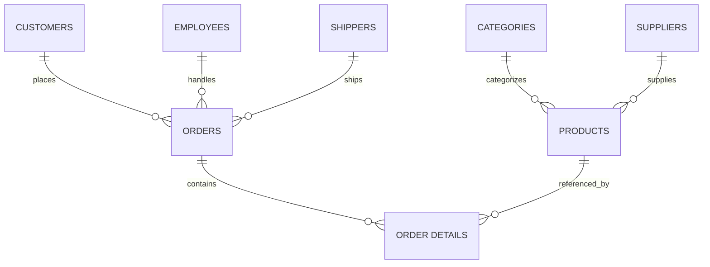

# Northwind SQL Queries — Project Showcase

**Author:** Vijayan Naidu (MSc Data Science)
**Repository:** *(https://github.com/vj220803/Northwind-SQL.git)*

---

## 📌 Project Overview

This project demonstrates SQL skills on the classic **Northwind** database. It contains a collection of queries ranging from **basic SELECTs to advanced window functions and optimizations**. The queries solve practical business problems and showcase mastery of relational databases.

The complete set of queries is available in **[`SQLQuery1.sql`](./SQLQuery1.sql)**.

---

## 🎯 Objectives

* Practice and showcase SQL proficiency (basic → advanced).
* Work with a real-world-like schema involving **customers, orders, products, suppliers, and employees**.
* Apply **joins, subqueries, CTEs, window functions, grouping, and set operations**.
* Understand **cardinality and relationships** in relational databases.
* Provide examples of **performance optimization** and **indexing**.

---

## 📂 Repository Structure

```
📁 northwind-sql-project
 ├── README.md            # Project documentation (this file)
 ├── SQLQuery1.sql        # All queries with comments
 ├── docs/
 │    ├── ERD.png         # ER diagram (optional)
 │    ├── sample_results/ # Example outputs (optional)
```

---

## 🗄️ Database Schema & Cardinality

The Northwind database models a small trading company. Key relationships:

* One Customer → Many Orders (1\:N)
* One Order → Many Order Details (1\:N)
* One Product → Many Order Details (1\:N)
* One Category → Many Products (1\:N)
* One Supplier → Many Products (1\:N)
* One Employee → Many Orders (1\:N)
* One Shipper → Many Orders (1\:N)



---

## 🧩 Query Categories

The queries cover:

1. **Basic Retrievals** → SELECT, WHERE, ORDER BY, LIMIT.
2. **Aggregations** → GROUP BY, HAVING, SUM, AVG, COUNT.
3. **Joins** → INNER JOIN, LEFT/RIGHT JOIN, FULL OUTER JOIN.
4. **Subqueries & CTEs** → Nested queries, WITH clause.
5. **Window Functions** → RANK, DENSE\_RANK, ROW\_NUMBER, OVER (PARTITION BY).
6. **Set Operations** → UNION, INTERSECT, EXCEPT.
7. **Advanced Analysis** → Top N queries, sales performance, customer insights.
8. **Optimization** → Indexing suggestions, query plan analysis.

---

## 📌 Example Queries

Here are a few representative queries from the project:

### 1. Top 5 Customers by Total Sales

```sql
SELECT c.CustomerName, SUM(od.UnitPrice * od.Quantity) AS TotalSales
FROM Customers c
JOIN Orders o ON c.CustomerID = o.CustomerID
JOIN [Order Details] od ON o.OrderID = od.OrderID
GROUP BY c.CustomerName
ORDER BY TotalSales DESC
LIMIT 5;
```

**Explanation:** Calculates customer revenue using joins and aggregation.

---

### 2. Employees Handling the Most Orders

```sql
SELECT e.FirstName, e.LastName, COUNT(o.OrderID) AS OrdersHandled
FROM Employees e
JOIN Orders o ON e.EmployeeID = o.EmployeeID
GROUP BY e.FirstName, e.LastName
ORDER BY OrdersHandled DESC;
```

**Explanation:** Demonstrates grouping and counting relationships.

---

### 3. Products with Above-Average Price (Subquery)

```sql
SELECT ProductName, UnitPrice
FROM Products
WHERE UnitPrice > (SELECT AVG(UnitPrice) FROM Products);
```

**Explanation:** Uses a subquery to filter results dynamically.

---

### 4. Ranking Products by Sales using Window Functions

```sql
SELECT p.ProductName,
       SUM(od.Quantity * od.UnitPrice) AS TotalSales,
       RANK() OVER (ORDER BY SUM(od.Quantity * od.UnitPrice) DESC) AS SalesRank
FROM Products p
JOIN [Order Details] od ON p.ProductID = od.ProductID
GROUP BY p.ProductName;
```

**Explanation:** Combines aggregation with window functions for ranking.

---

## 🚀 How to Run

1. Install Northwind database on your RDBMS (SQL Server, MySQL, PostgreSQL, or SQLite).
2. Clone this repository:

   ```bash
   git clone <your-repo-url>
   cd northwind-sql-project
   ```
3. Open `SQLQuery1.sql` in your SQL client.
4. Run queries sequentially or explore specific sections.

---

## 📈 Skills Showcased

* SQL Fundamentals & Advanced Queries
* Database Schema Understanding & Cardinality
* Data Aggregation & Analytics
* Window Functions & Ranking
* Query Optimization & Indexing
* Business Problem-Solving with SQL

---

## 📜 License

This project is for educational and portfolio purposes. Free to use with attribution. 

